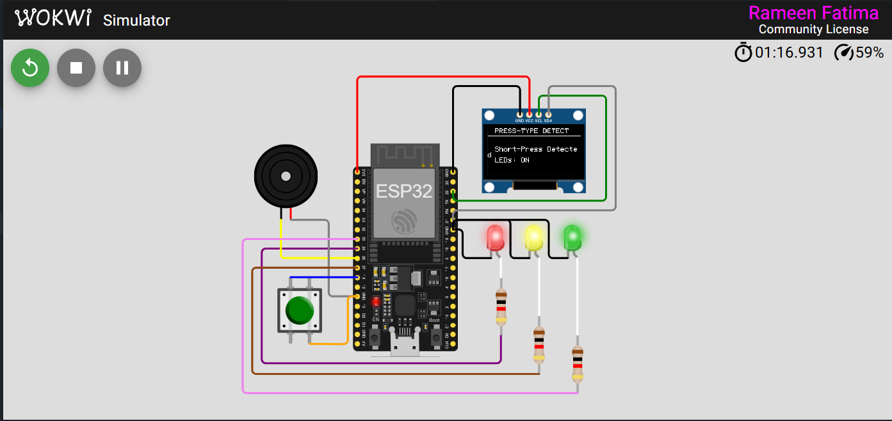
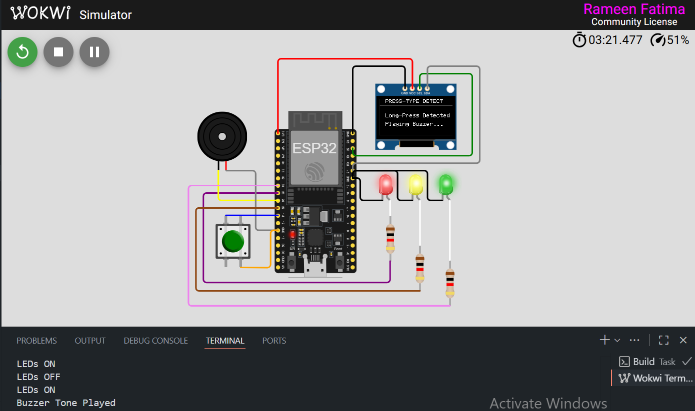
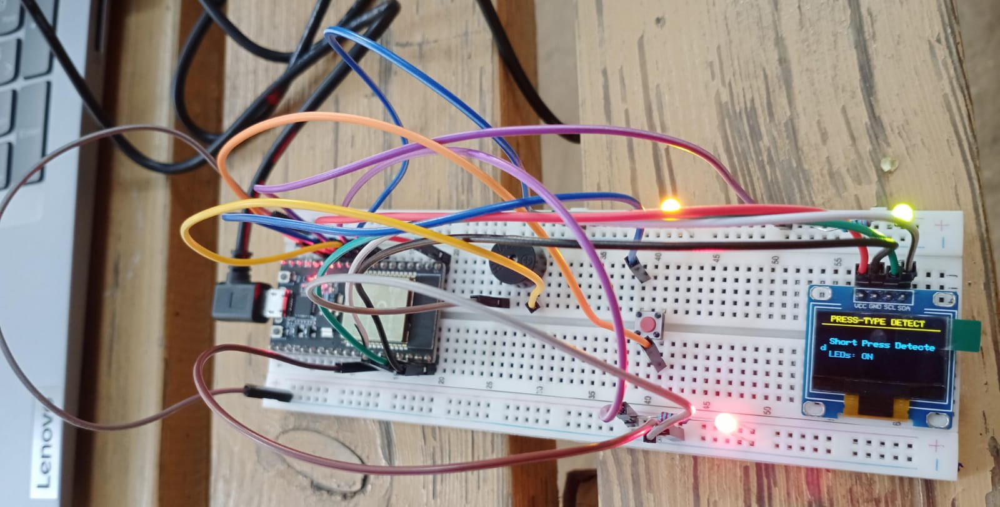
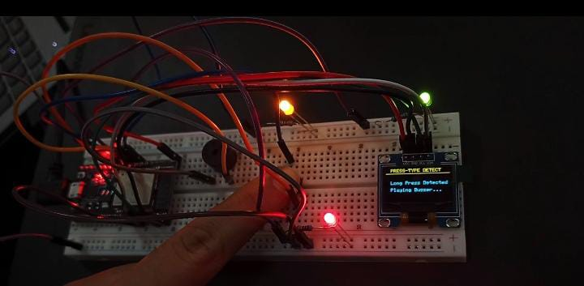

# Assignment 1 - ESP32 Multi-LED Control with Press-Type Detection  

**Name:** Rameen Fatima  **Reg. No:** 23-NTU-CS-1086 
**Course:** Embedded IoT Systems  **Section:** BSCS - 5th B  

---

## Wokwi Project Link
[Click here to open Wokwi Project](https://wokwi.com/projects/445452596000373761)

---

## Description
This project demonstrates how to detect **short press** and **long press** actions using a **single button** on the **ESP32**.  
Each press type triggers a different response with visual feedback on an **OLED display** and hardware components.  

### Functional Overview:
- **Short Press (<1.5 seconds):**  
  - Toggles all 3 LEDs **ON/OFF** simultaneously.  
  - Displays `"Short-Press Detected"` on the OLED.  
- **Long Press (>1.5 seconds):**  
  - Activates a **buzzer tone (1 kHz for 0.5 sec)**.  
  - Displays `"Long-Press Detected"` and `"Playing Buzzer..."` on the OLED.  
- **OLED Header:**  
  - Shows the title `"PRESS-TYPE DETECT"` with an underline header.  

---

## Pin Map

| Component | ESP32 Pin | Description |
|------------|------------|--------------|
| Button | 14 | Detects press type (short/long) |
| LED 1 | 25 | First LED (ON/OFF toggle) |
| LED 2 | 27 | Second LED (ON/OFF toggle) |
| LED 3 | 33 | Third LED (ON/OFF toggle) |
| Buzzer | 26 | Plays tone on long press |
| OLED SDA | 21 | I²C Data Line |
| OLED SCL | 22 | I²C Clock Line |
| OLED VCC | 3.3V | Power Supply |
| OLED GND | GND | Common Ground |

---

## Components Used
- ESP32 Development Board  
- 1 Push Button  
- 3 LEDs (Red, Green, Blue)  
- 1 Buzzer  
- 0.96” OLED Display (SSD1306, I²C)  
- Resistors and Jumper Wires  

---

## Screenshots

### Wokwi Circuit

### OLED Outputs

Additional screenshots and test captures are stored in the `/screenshots` folder.

---

## 📝 Notes
- The project uses **Adafruit_SSD1306** and **Adafruit_GFX** libraries for OLED control.  
- **tone()** function generates PWM-based sound signals on the buzzer.  
- The button is configured with **internal pull-up**, so it reads **LOW** when pressed.  
- Debouncing handled through simple logic using `millis()` timing.  

---