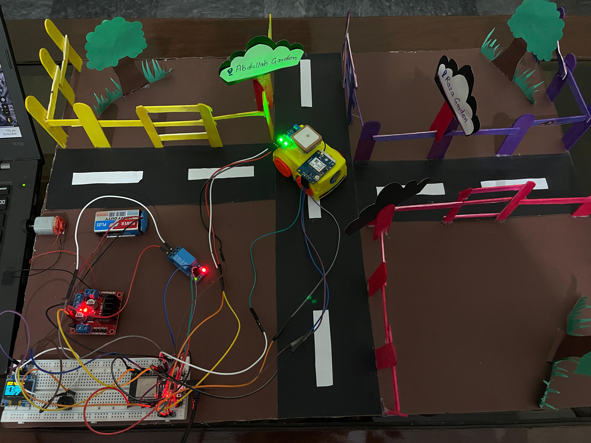

# 🚗 ESP32-Based Smart Car Tracking & Anti-Theft System

##  Project Description
This project is an **IoT-based smart car security and tracking system** developed using the **ESP32 microcontroller**.  
It enables **remote vehicle control, real-time GPS tracking, theft detection, and geo-fence alerts** through a mobile application.

The system is designed to enhance vehicle security by integrating **GPS, vibration sensing, engine locking, and cloud-based monitoring**.

---

## 🎯 Objectives
- To remotely control vehicle movement using a mobile app
- To implement engine lock/unlock for theft prevention
- To track real-time vehicle location using GPS
- To detect unauthorized vehicle movement (vibration)
- To generate alerts on geo-fence breach
- To display live system status on an OLED screen

---

## ✨ Key Features
- 🔄 Motor control (Forward / Backward) via Blynk
- 🔐 Engine Lock / Unlock using relay
- 📍 Live GPS tracking
- 🌐 ThingSpeak cloud integration for data logging
- 🚨 Geo-fence breach detection with buzzer & alert
- 📳 Vibration-based theft detection (car lifting alert)
- 🖥 OLED display for real-time status monitoring

---

## 🧰 Hardware Components
- ESP32 Development Board  
- DC Motor & Motor Driver  
- Relay Module (Engine Lock)  
- GPS Module (Neo-6M or equivalent)  
- Vibration Sensor  
- Buzzer  
- OLED Display (SSD1306 – I2C)  
- Battery / Power Supply  
- Jumper Wires  

---

## 💻 Software & Technologies Used
- Arduino IDE  
- Blynk IoT Platform  
- ThingSpeak Cloud Platform  
- VS Code  
- GitHub  

---

## 📸 System Overview

---

## ⚙️ System Architecture
1. ESP32 connects to WiFi and Blynk server
2. User controls motor direction via Blynk mobile app
3. Relay locks/unlocks engine remotely
4. GPS module continuously fetches vehicle coordinates
5. GPS data is uploaded to ThingSpeak for visualization
6. Geo-fence logic monitors vehicle movement
7. Vibration sensor detects unauthorized activity
8. Alerts are sent and buzzer is activated when required
9. OLED displays live system status

---

## 📊 Data Monitoring & Alerts
- Latitude and longitude are uploaded to ThingSpeak
- Real-time graphs visualize vehicle movement
- Alerts are generated for:
  - Vehicle vibration (theft attempt)
  - Geo-fence boundary violation

---

## 🚀 Applications
- Vehicle theft prevention
- Fleet management systems
- Smart transportation systems
- IoT-based vehicle monitoring

---

## 🧪 Testing & Results
- Motor responds correctly to mobile commands
- Engine lock successfully disables motor operation
- GPS location updates accurately on ThingSpeak
- Geo-fence alerts trigger beyond defined radius
- Vibration sensor detects unauthorized movement
- OLED displays real-time system status reliably

---

## 📌 Conclusion
The ESP32 Smart Car Security & Tracking System successfully demonstrates the integration of **IoT, embedded systems, and cloud services** to provide a reliable vehicle security solution.  
The system is scalable and can be enhanced further with additional sensors and features.

---

